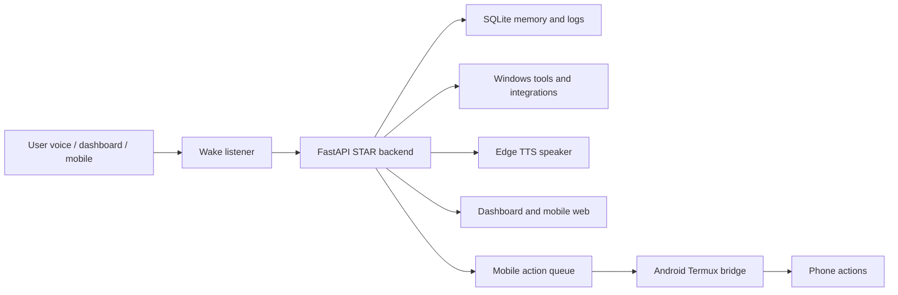

# STAR Assistant

<p align="center">
  
  
  
  
  
</p>

STAR is a local-first desktop assistant for Windows. It listens for `hello star`, understands Hinglish, Hindi-style commands, and English, speaks back with Edge TTS, controls the laptop, remembers useful context, runs productivity workflows, and can extend to Android through a secure Termux phone bridge.

The project is built like a personal operating layer: a FastAPI brain, a wake-word listener, a web dashboard, persistent SQLite memory, local automation tools, optional Groq intelligence, and a mobile companion that lets the phone participate without turning the laptop server off.

## Experience

STAR is meant to feel like a practical assistant sitting on your machine, not a demo script. You can say `hello star open chrome`, ask for your agenda, close apps in Hinglish, run WhatsApp helpers, queue phone actions, or put STAR into sleep/quiet mode without killing the backend.

| Surface | What it does |
| --- | --- |
| Voice runtime | Wake phrase, continuous listening, stop/repeat/sleep/quiet/resume controls |
| Web dashboard | Chat, memory, tasks, voice settings, integrations, analytics, logs, phone pairing |
| Mobile web | Phone browser command mode with phone-side spoken replies |
| Android bridge | Termux worker for phone actions like vibrate, speak, torch, volume, media, clipboard, location |
| Local brain | SQLite memory, conversation history, logs, command history, suggestions, confirmations |

## Architecture



## Capability Map

| Area | Highlights |
| --- | --- |
| Voice | Free speech wake mode, optional Picovoice, female TTS, multilingual fallback, quiet mode, wake-only sleep mode |
| Language | Hinglish-friendly cleanup, Hindi/local command normalization, same-language emotional replies |
| Laptop control | Open/close apps, browser tabs, screenshots, typing, scrolling, volume, brightness, system status |
| Productivity | Notes, tasks, reminders, calendar, daily briefing, Pomodoro, contacts, clipboard, snippets |
| Knowledge | Research search, latest news, weather, Wikipedia-style lookup, webpage and file summaries |
| Personal data | Finance tracker, health logs, memory recall/edit/forget, analytics, command history |
| Messaging | WhatsApp Web helpers, email IMAP/SMTP helpers, mobile notifications |
| Automation | Scheduled commands, simple workflows, due runs, action history |
| Security | Confirmation gates, blocked server-stop voice commands, audit logs, mobile shared-secret pairing |
| Mobile | Mobile web companion plus Android bridge for phone-side speak, vibrate, notification, torch, volume, media keys, clipboard, location, Wi-Fi and device info |
| Smart home | Home Assistant status and service-call foundation |
| Coding/Git | Project analysis, code search, explain/review file, compile check, git status/log/diff/branch/commit/push |

## Quick Start

### 1. Create the environment

```powershell
python -m venv venv
.\venv\Scripts\activate
pip install -r requirements.txt
```

### 2. Configure optional secrets

Create `.env` in the project root.

```env
GROQ_API_KEY=your_groq_key
EMAIL_ADDRESS=your_email_address
EMAIL_APP_PASSWORD=your_email_app_password
```

`PICOVOICE_ACCESS_KEY` is optional. Without it, STAR uses the free keyless speech wake mode.

### 3. Start STAR

```powershell
.\scripts\start_star.ps1
```

The script starts the backend and wake listener in the background. It is duplicate-safe, so running it again will not create extra backend copies.

### 4. Open the dashboard

```text
http://127.0.0.1:8000/dashboard
```

Runtime helpers:

```powershell
.\scripts\status_star.ps1
.\scripts\stop_star.ps1
.\scripts\install_startup.ps1
.\scripts\uninstall_startup.ps1
```

After `install_startup.ps1`, STAR starts automatically when the Windows user logs in. It keeps running until the laptop shuts down, restarts, or you manually stop it.

## Voice Behavior

| Say this | Result |
| --- | --- |
| `hello star` | Wake STAR and start command mode |
| `talk in english` / `english me baat kar` | Force English replies and English TTS profile |
| `talk in hindi` / `hindi me baat kar` | Force Hindi replies and Hindi TTS profile |
| `talk in hinglish` / `hinglish me baat kar` | Force Hinglish replies and Indian English TTS profile |
| `stop` | Stop current speech only, server stays on |
| `repeat` or `dobara bolo` | Repeat last response |
| `star u can sleep` / `star sleep` / `star so ja` | Exit command mode and keep wake listening alive |
| `hello star` after sleep | Start listening again |
| `star abhi chup` / `star band ho ja` | Quiet mode; normal conversation is ignored |
| `ok star you can talk` / `chal star tu ab baat kar sakta hai` | Resume replies from quiet mode |
| `stop server` / `close backend` | Blocked from voice so the server does not get killed accidentally |

## Mobile Companion

STAR has two mobile layers.

| Layer | Best for | URL / setup |
| --- | --- | --- |
| Mobile web | Phone browser voice commands and phone-side replies | `http://YOUR-LAPTOP-IP:8000/mobile` |
| Android Termux bridge | Phone system actions that browsers cannot perform | `mobile_bridge/README.md` |

Run this to see the current phone-ready URL:

```powershell
.\scripts\status_star.ps1
```

Open the mobile URL on a phone connected to the same Wi-Fi. Tap `Start Wake`, allow microphone access, then say `hello star`.

For secure Android bridge pairing, open the dashboard, go to `Integrations`, find `Phone Bridge`, click `Rotate Secret`, copy the generated Termux commands, and paste them into Termux.

Phone bridge examples:

| Command | Result |
| --- | --- |
| `phone find` | Makes the phone announce/vibrate so you can find it |
| `phone speak hello bhai` | Speaks on the phone |
| `phone vibrate` | Vibrates the phone |
| `phone notify STAR message Check your tasks` | Shows a phone notification |
| `phone torch on` / `phone torch off` | Controls flashlight |
| `phone volume 10` / `phone volume max` | Changes media volume |
| `phone brightness 180` / `phone brightness auto` | Changes brightness |
| `phone media play pause` / `phone media next` | Sends media key events |
| `phone clipboard set hello` / `phone clipboard read` | Writes or reads phone clipboard |
| `phone location` / `phone wifi` / `phone device info` | Queues device information actions |

Android security still applies. Call and SMS commands open Android intents; they do not silently place calls or send messages.

## Dashboard

The dashboard is the control room for STAR.

| Tab | Purpose |
| --- | --- |
| Overview | System snapshot, metrics, quick actions, recent commands |
| Chat | Send natural language prompts or commands |
| Memory | Inspect and edit remembered facts |
| Tasks | Tasks, reminders, and scheduling |
| Voice | Language, wake engine, TTS, repeat/quiet/resume controls |
| Integrations | Cloud sync, mobile notifications, phone pairing, phone actions, smart home |
| Suggestions | Self-learning recommendations from usage, health, finance, tasks and errors |
| Analytics | Command success rate, top tools, daily activity, recent issues |
| Logs | Recent runtime logs and conversation history |

## Command Cookbook

### Laptop and browser

| Intent | Example |
| --- | --- |
| Open app | `open chrome` |
| Close app | `chrome band karo` |
| Open folder | `open downloads` |
| Search web | `google search FastAPI tutorial` |
| Browser tab | `new tab github.com`, `close tab`, `next tab` |
| Screen | `take screenshot`, `read screen`, `analyze screen` |
| System | `system status`, `cpu usage`, `battery status`, `show running processes` |
| Media | `play music`, `next song`, `open youtube lo-fi music` |

### Memory and personal organization

| Intent | Example |
| --- | --- |
| Remember | `remember my city is Ahmedabad` |
| Recall | `what do you remember` |
| Forget | `forget my city` |
| Notes | `add note buy milk`, `show notes` |
| Tasks | `add task finish STAR dashboard`, `complete task 1` |
| Reminders | `remind me to drink water in 10 minutes` |
| Calendar | `add event dentist tomorrow at 5 pm for 30 minutes location clinic` |
| Agenda | `today agenda`, `tomorrow agenda`, `upcoming events` |
| Contacts | `add contact Bajrangi email bajrangi@example.com phone +919999999999` |

### Files, research and knowledge

| Intent | Example |
| --- | --- |
| Find file | `find file README` |
| Read file | `read file README.md` |
| Summarize | `summarize file main.py` |
| Folder analysis | `analyze folder downloads` |
| Research | `research Python FastAPI` |
| Weather/news | `weather Ahmedabad`, `latest news AI` |
| Webpage | `summarize webpage https://example.com` |

### Finance, health and productivity

| Intent | Example |
| --- | --- |
| Expense | `add expense 250 for food note lunch` |
| Income | `add income 5000 for salary` |
| Finance summary | `finance summary`, `monthly expenses`, `expense categories` |
| Health | `log water 500 ml`, `log sleep 7 hours`, `log workout 30 minutes running` |
| Wellness | `health summary`, `show health logs`, `log mood happy` |
| Focus | `start pomodoro 25`, `pomodoro status` |

### Integrations and automation

| Intent | Example |
| --- | --- |
| Email | `email test`, `read emails`, `search emails invoice` |
| WhatsApp | `whatsapp status`, `send whatsapp to Bajrangi message hello` |
| Cloud | `cloud sync now` |
| Mobile | `send mobile notification STAR message Check your tasks` |
| Smart home | `smart home turn on light.kitchen` then `confirm` |
| Suggestions | `smart suggestions`, `dismiss suggestion log_water` |
| Coding | `analyze project`, `search code FastAPI`, `run compile check` |
| Git | `git status`, `git diff`, `git commit update STAR features` then `confirm` |

## API Surface

Core routes:

| Route | Purpose |
| --- | --- |
| `GET /dashboard` | Web dashboard |
| `GET /mobile` | Mobile companion page |
| `GET /ask-star?q=...` | Run a STAR command |
| `GET /health` | Health and feature stats |
| `GET /settings` | Runtime settings and integration state |
| `GET /voice/status` | Voice state, settings and last reply |
| `POST /voice/settings` | Update voice settings |
| `POST /voice/quiet` / `POST /voice/resume` / `POST /voice/sleep` | Voice mode controls |

Mobile and bridge routes:

| Route | Purpose |
| --- | --- |
| `GET /mobile/status` | Mobile status and wake phrases |
| `GET /mobile/pairing` | Pairing data and Termux command block |
| `POST /mobile/pairing/regenerate` | Rotate mobile shared secret |
| `POST /mobile/command?command=...` | Run STAR from mobile without laptop TTS |
| `POST /mobile/devices/register?device_id=...` | Register Android bridge |
| `GET /mobile/devices` | List connected bridge devices |
| `POST /mobile/actions?action=...` | Queue a phone action |
| `GET /mobile/actions/pull?device_id=...` | Phone bridge pulls queued actions |
| `POST /mobile/actions/{id}/complete` | Phone bridge reports result |

Productivity and integrations:

| Route group | Includes |
| --- | --- |
| `/memory`, `/history`, `/commands`, `/logs` | Personal memory and audit trail |
| `/tasks`, `/reminders`, `/calendar` | Personal productivity |
| `/contacts`, `/notes`, `/snippets` | Saved personal data |
| `/finance`, `/health` | Trackers and summaries |
| `/integrations`, `/cloud/sync`, `/smart-home` | External integration layer |
| `/analytics`, `/suggestions` | Usage intelligence and smart recommendations |

## Project Layout

```text
.
|-- main.py                       FastAPI backend and command router
|-- wake_word.py                  Wake listener and conversation loop
|-- star_voice.py                 Voice settings, wake phrases, quiet/sleep logic
|-- star_storage.py               SQLite schema and persistence helpers
|-- star_integrations.py          Cloud, mobile bridge, smart home helpers
|-- web/                          Dashboard and mobile web UI
|-- mobile_bridge/                Android Termux bridge and setup guide
|-- scripts/                      Start, stop, status and startup scripts
|-- requirements.txt              Python dependencies
`-- star.db                       Local SQLite database
```

## Safety Model

STAR is intentionally local-first. The backend runs on your laptop, memory stays in SQLite, and high-risk actions use confirmation gates. Voice commands cannot stop the backend. Mobile pairing can use a shared secret, and the dashboard can rotate that secret.

Some integrations still depend on external accounts or services:

| Feature | Needs |
| --- | --- |
| Groq intelligence | `GROQ_API_KEY` |
| Email | Email address and app password |
| Picovoice wake word | Optional `PICOVOICE_ACCESS_KEY` |
| Smart home | Home Assistant URL and token |
| Android bridge | Termux and Termux:API installed on the phone |

## Notes

The Android bridge gives useful phone control, but it does not bypass Android permission rules. For deeper phone automation, the next step is a native Android companion with an Accessibility service and explicit user-granted permissions.

Cloud sync currently writes local snapshots to `CLOUD_SYNC_DIR` or `cloud_sync/`. Full Google Drive, OneDrive or Dropbox sync can be added on top of the same integration layer.
